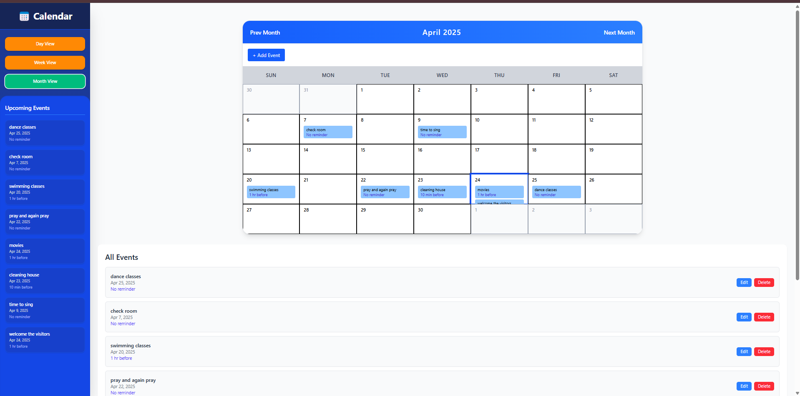
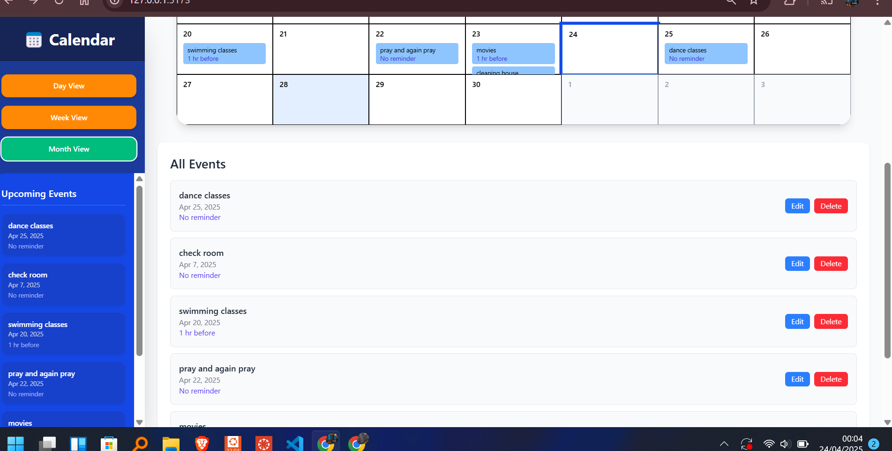

# 🌟 ChronoFlow – Where Time Meets Organization

ChronoFlow is a sleek and powerful calendar application built with **React**, **TypeScript**, and **Tailwind CSS**. It allows users to manage their time with precision using intuitive **day**, **week**, and **month** views. Featuring **event creation**, **editing**, **deletion**, **reminders**, and even **drag-and-drop rescheduling**, ChronoFlow is your ultimate productivity companion.

---
## 📸 Screenshots




## 🚀 Features

- 📆 **Multi-View Calendar**: Switch seamlessly between Day, Week, and Month views.
- 📝 **Event Management**: Add, edit, and delete events with a beautiful modal interface.
- 🔁 **Recurring Events** (Planned): Schedule repeating tasks with flexibility.
- 🔔 **Reminders**: Get notified before your events start.
- 🖱️ **Drag-and-Drop**: Easily reschedule events with intuitive interaction.
- 🧭 **Highlighted Events**: Click an event in the sidebar to highlight it in the main calendar.
- 📋 **Sidebar Event List**: View and select events from a responsive sidebar.

---

## 🧪 Tech Stack

- ⚛️ React + TypeScript
- 🎨 Tailwind CSS
- 💡 React Beautiful DnD
- 📦 json-server (for local data persistence)
- 📅 date-fns (for date handling)

---

---

## 🛠️ Setup Instructions

1. **Clone the repository:**
   ```bash
   git clone git@github.com:IsaacDev14/ChronoFlow-Web-App.git
   cd ChronoFlow-Web-App

## Folder structure 
src/
├── components/        # Reusable UI components (Calendar, Modals, Cards)
├── pages/             # Application views
├── services/          # API services
├── types.ts           # TypeScript type definitions
├── utils/             # Utility functions (e.g., notifications)
public/
└── db.json            # Simulated database for events

##  📅 Future Enhancements
    **Support for recurring events**

    **Calendar syncing (Google, Outlook)**

    **Notification sounds**

    **Drag-to-create events**

